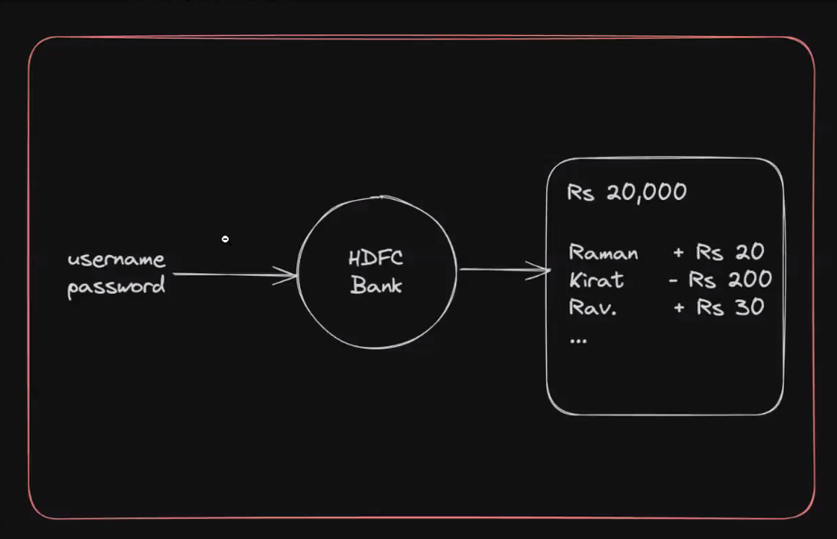
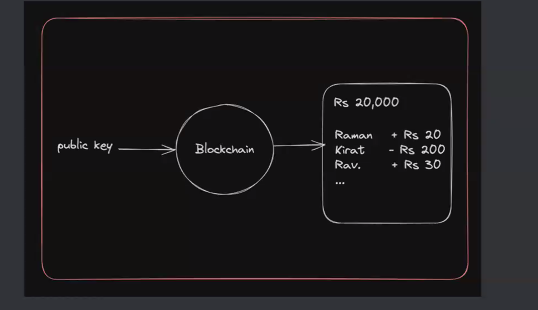
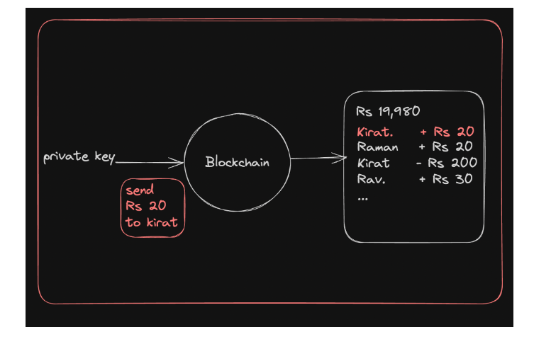
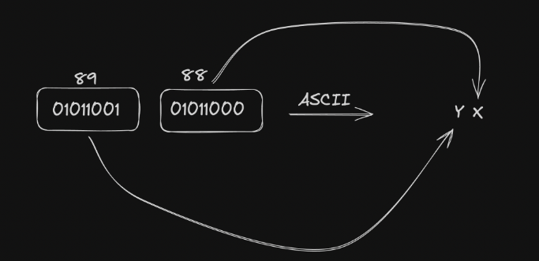
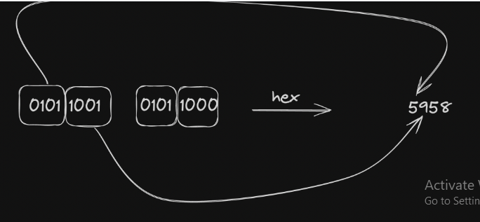
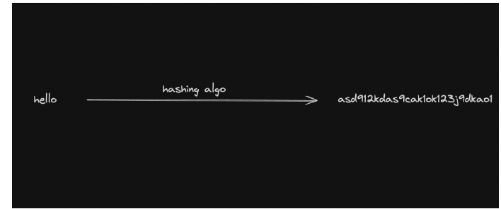
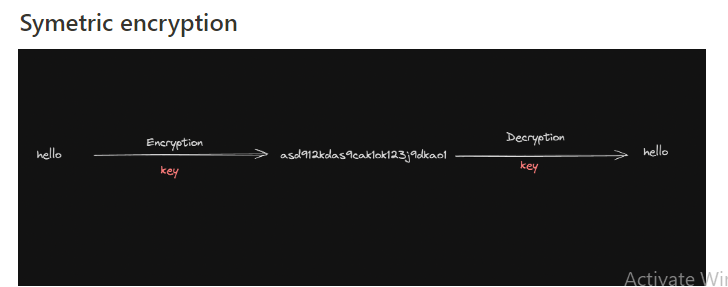
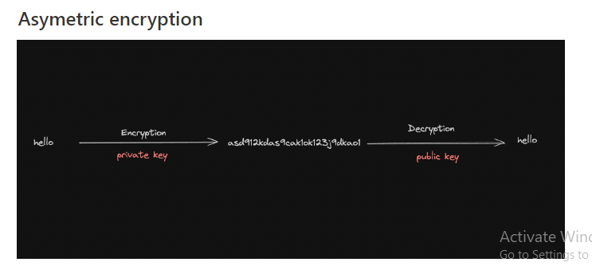

# Public Key Cryptography 

# Banks vs Blockchains

- How banks do Auth

- In te=raditional banks, you have a username and passowrd that are enough for you to 
    1. Look at your funds
    2. transfer funds
    3. look at your existing transactions 




# How Blockchains do auth 

1. if you ever want to create an account on a blockchain, you need to genrate a public-private keypair

# Public private keypair

1. A public-private key pair is a set of two keys used in asymmetric cryptography. These two keys have the following characteristics:

2. Public Key: The public key is a string that can be shared openly.

```not your keys not your crypto```



For example -
``` https://etherscan.io/address/0xD9a657ACB3960DB92AaaA32942019bD3c473FCCB```

- Private key:
     The private key is a secret string that must be kept confidential. 




# 2 - Public Key Cryptography

# Bits and bytes 

- What is a bit ?

A bit is smallest unit of data in a computer and can have one of two values: 0 or 1.

- WHat is a byte ?

A byte is group of 8 bits. Its's the standard unit of data to represent a single charachter in memory. SInc each bit can be either 0 or 1, a yte can have 2^8(256) possible values, raning from 0 to 255

# Assignment 

What is the ```11001010``` converted to byte ?


2^7: 1×27=1×128=128 
+
2^6: 1×26=1×64=64
+
2^5: 0×25=0×32=0
+
2^4: 0×24=0×16=0
+
2^3: 1×23=1×8=8
+
2^2: 0×22=0×4=0
+
2^1: 1×21=1×2=2
+
2^0: 0×20=0×1=0
= 202


# Representing bits and bytes in JS 

- Bit

``` 
const x=0;
console.log(x);
```

- Byte 

```
const x= 202;
console.log(x);
```

- Array of bytes 
```
const bytes = [202,244,1,23];
console.log(bytes);
```

- UInt8Array

A better way to represent an array of bytes is to use a ```UInt8Array``` in JS

```
let bytes = new Uint8Array([0,255,127,128]);
console.log(bytes);
```

Why use Uint8Array over native arrays?

- They use less space. Every number takes 64 bits (8 bytes). But every value in ```UInt8Array``` takes 1 byte

- UInt8Array Enforces constraints - It makes sure every element dosen't exceed 255

# Assignment - 

What do you think happens to the first element here? Does it throw error?

```
let uint8Arr = new Uint8Arry([0,255,127,128]);
uint8Arr[1]=300;
```

private keys => is only of array of bytes 32 bytes  , 1 byte is 8 bits , -> 255^32 number of possiblities 
- is a string which is again a string a 32 chars 

public keys => 

- solona.createSecret => uses uint8Array()


# Encodings

Bytes are cool but highly unreadable. Imagine telling someone 

``` Hey, my name is 01000001 01111010 01101001 01101101 ```

Its easier to encode data so it is more human readable. Some common encodings include - 

1. ASCII
2. HEX
3. Base64
4. Base58

- Byte => 0 - 255

66
26 => alphabets lowercase
26 => alphabets uppercase
10 => numbers 

-  Bits => 0,1

# ASCII

```1 character = 7 bits```

Every byte corresponds to a text on the computer.

Here is a complete list - ```https://www.w3schools.com/charsets/ref_html_ascii.asp#:~:text=The ASCII Character Set&text=ASCII``` is a 7-bit,are all based on ASCII.

1. Bytes to Ascii
2. Ascii to bytes 
3. UInt8Array to ascii
4. Ascii to UInt8Array 



# Hex 

```1 character = 4 bits```

A single hex character can be any of the 16 possible values: 0-9 and A-F

- Array to hex 
- Hex to array 

```Ref - https://developer.mozilla.org/en-US/docs/Web/JavaScript/Reference/Global_Objects/parseInt```



# Base64 

``1 character = 6 bits```

Base64 encoding uses 64 different characters(A-Z, a-z,0-9,+,/), which means each character can represent one of 64 possible values.

```
https://www.base64encode.org/
https://www.base64decode.org/
```

```
const uint8Array = new Uint8Array([72, 101, 108, 108, 111]);
const base64Encoded = Buffer.from(uint8Array).toString("base64");
console.log(base64Encoded);
```

# Base58

It is similar to Base64 but uses a different set of characters to avoid visually similar characters and to make the encoded output more user-friendly 

Base58 uses 58 different characters:

1. Uppercase letters: A-Z (excluding I and O)
2. Lowercase letters: a-z (excluding l)
3. Numbers: 1-9 (exluding 0)

Encode 

```
const bs58 = require('bs58');

function uint8ArrayToBase58(uint8Array) {
  return bs58.encode(uint8Array);
}

// Example usage:
const byteArray = new Uint8Array([72, 101, 108, 108, 111]); // Corresponds to "Hello"
const base58String = uint8ArrayToBase58(byteArray);
console.log(base58String); // Output: Base58 encoded string

```
Decode 

```
const bs58 = require('bs58');

function base58ToUint8Array(base58String) {
  return bs58.decode(base58String);
}

// Example usage:
const base58 = base58String; // Use the previously encoded Base58 string
const byteArrayFromBase58 = base58ToUint8Array(base58);
console.log(byteArrayFromBase58); // Output: Uint8Array(5) [72, 101, 108, 108, 111]
```
# Hashing vs encryption

# Hashing 

Hashing is a process of converting data (like a file or a message) into a fixed-size string of characters, which typically appears random 



Common hasing algorthims - SHa-256, MD5

# Encryption 

Encryption is the process of converting plaintext data into a unreadable format, called ciphertext, using a specific algorithm and a key. The data can be decrypted back to its original form only with the appropriate key.

# Key characteristics:

1. Reversible: With the correct key, the ciphertext can be decrypted back to plaintext.
2. Key-dependent: The security of encryption relies on the secrecy of the key.
Two main types:
    1. Symmetric encryption: The same key is used for both encryption and decryption.
    2. Asymmetric encryption: Different keys are used for encryption (public key) and decryption (private key).



```
const crypto = require('crypto');

// Generate a random encryption key
const key = crypto.randomBytes(32); // 32 bytes = 256 bits
const iv = crypto.randomBytes(16); // Initialization vector (IV)

// Function to encrypt text
function encrypt(text) {
    const cipher = crypto.createCipheriv('aes-256-cbc', key, iv);
    let encrypted = cipher.update(text, 'utf8', 'hex');
    encrypted += cipher.final('hex');
    return encrypted;
}

// Function to decrypt text
function decrypt(encryptedText) {
    const decipher = crypto.createDecipheriv('aes-256-cbc', key, iv);
    let decrypted = decipher.update(encryptedText, 'hex', 'utf8');
    decrypted += decipher.final('utf8');
    return decrypted;
}

// Example usage
const textToEncrypt = 'Hello, World!';
const encryptedText = encrypt(textToEncrypt);
const decryptedText = decrypt(encryptedText);

console.log('Original Text:', textToEncrypt);
console.log('Encrypted Text:', encryptedText);
console.log('Decrypted Text:', decryptedText);

```



# Demo assignment 
```
https://andersbrownworth.com/blockchain/public-private-keys/
```


